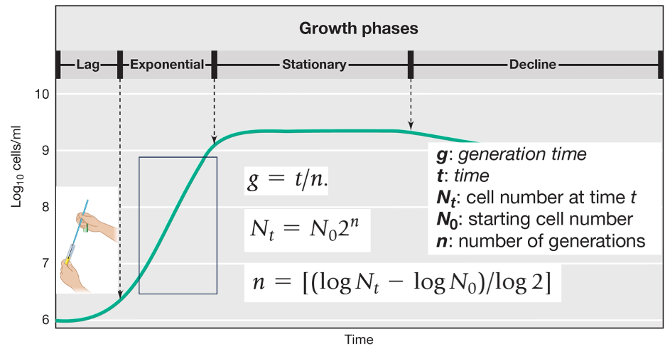

# pcr_input.py

I first asked ChatGPT-5 to create a PCR cycle calculator, where the user inputs the number of PCR cycles and the program calculates 2 to the power of the number of cycles , representing the theoretical number of DNA copies after amplification.

# exponential_growth_cli.py

In the second part, I provided ChatGPT-5 with the equations describing bacterial growth during the exponential phase.
The equations were:

 
I then asked ChatGPT-5 to build a command-line (CLI) tool where the user can enter the following parameters:
•	the initial number of cells (N0(
•	the total incubation time (t),
•	and the number of generations (n).
The program calculates and outputs:
•	the final number of cells (Nt) at time tt, and
•	the average generation time (g) per generation.

# bacterial_growth_gui.py

In the third part, I decided to expand the project beyond the exponential phase and include all bacterial growth phases.
I asked ChatGPT-5 to create a graphical user interface (GUI) that could automatically identify the current growth stage based on the input parameters entered by the user.
I explained to ChatGPT-5 the logic that should be used to determine the bacterial growth stage.
The classification rules I provided were expressed as follows:
Lag phase: If the current population (Nt) is only slightly higher than the initial population (N0):  Nt < 1.2 × N0
Exponential (Log) phase:  If the current population is increasing but still below most of the carrying capacity (K):  Nt < 0.9 × K
Stationary phase:  If the population is close to the carrying capacity:  |Nt − K| / K < 0.1
Death phase: If the population has started to decline beyond the stationary level:  Nt < K and decreasing over time

Based on these equations, ChatGPT-5 built a calculator that automatically determines the current growth phase according to the entered values and suggested adding a graph that visualizes the entire growth curve with the identified phase highlighted.
