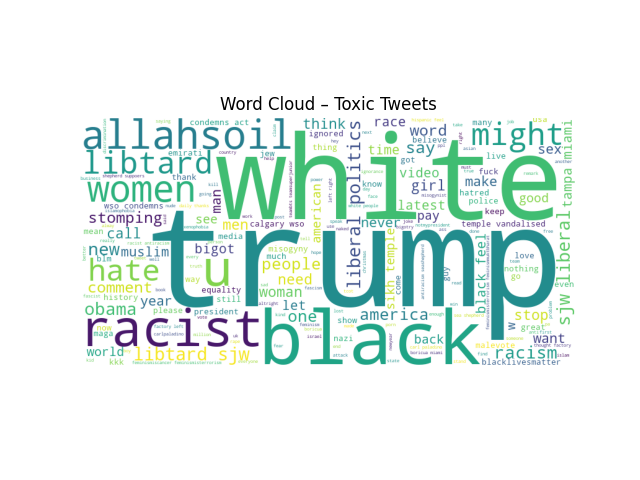

---

# Day 8 Assignment – Toxic Tweets Analysis

This repository contains my **Day 8 assignment**, focusing on exploratory data analysis and basic machine learning applied to text data.

---

## 📊 Dataset

I used a publicly available dataset from **Kaggle**:
**Twitter Toxic Tweets**, which contains short tweets labeled as *toxic* or *non-toxic*.

I chose this dataset because I am interested in how language, word choice, and context relate to toxic behavior in online platforms.

---

## Data Analysis & Processing

Using **Pandas** and **NumPy**, I:

* Loaded and explored the dataset
* Examined class imbalance between toxic and non-toxic tweets
* Cleaned and preprocessed the text (removing URLs, mentions, hashtags, and platform-specific noise)
* Split the data into training and test sets

The text cleaning was designed to reduce noise while preserving meaningful linguistic signals.

---

## Feature Engineering & Model

* Text was converted into numerical features using **TF-IDF vectorization** (unigrams + bigrams).
* A **Logistic Regression** classifier was trained to predict tweet toxicity.

This model was chosen because it works well with sparse text data and allows interpretation of which words influence predictions.

Model evaluation included:

* Confusion matrix
* Precision, recall, and F1-score
* ROC-AUC score

I also explored different operating points (e.g. decision thresholds) to understand trade-offs between recall and precision.

---

## 📈 Visualizations

To support the analysis, I created several plots:

* Label distribution (toxic vs. non-toxic)
* ROC curve
* Word clouds for toxic and non-toxic tweets:
* 

These visualizations help connect numerical results to actual language patterns in the data.

---

## 📝 Notes on Interpretation

In addition to performance metrics, I analyzed which words most strongly push predictions toward *toxic* or *non-toxic*.
This revealed both explicit toxic language and topic-related biases, highlighting limitations of simple word-based models.

---

## 🤖 Use of AI Tools

During this assignment, I used **ChatGPT5** as a supporting tool to:

* Discuss modeling choices and trade-offs
* Debug and refactor code
* Improve clarity of explanations and documentation

All final decisions, implementation, and interpretation were done by me.

---

## ✅ Summary

This project demonstrates:

* Use of a real-world dataset
* Data analysis with Pandas and NumPy
* Basic machine learning on text data
* Model evaluation and interpretation
* Clear visual presentation of results

